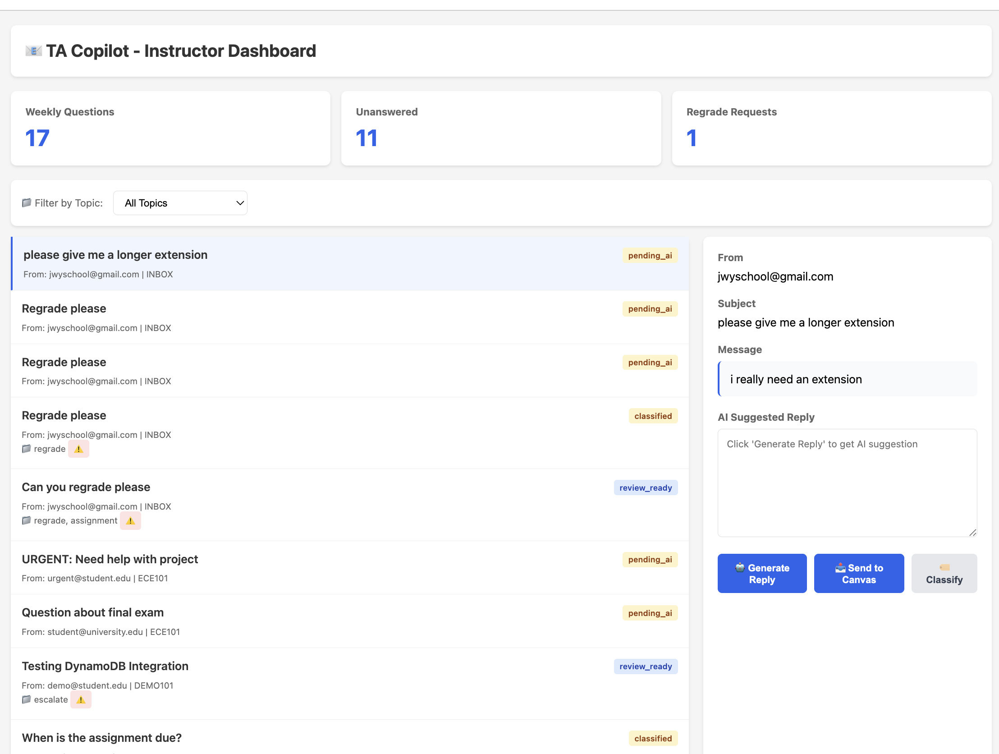
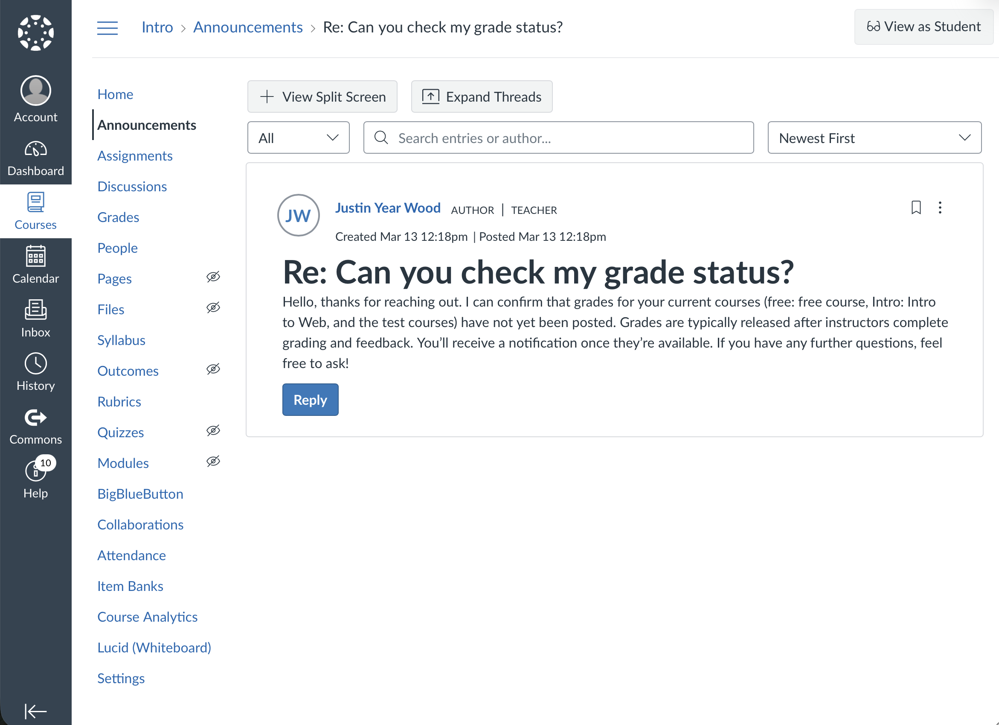

# TA Copilot - AI Teaching Assistant for Email Management

## 🎯 Project Objective

TA Copilot is an AI-powered teaching assistant that helps educators efficiently manage and respond to student emails. The system leverages Amazon Bedrock's generative AI capabilities to automatically summarize, classify, and draft responses to student inquiries, reducing the time instructors spend on email management while maintaining personalized, high-quality communication.


## 🚀 Our Goal

Transform the way educators handle student communications by:
- **Reducing Response Time**: Automate email triage and draft generation
- **Improving Consistency**: Ensure all students receive timely, professional responses
- **Enhancing Context Awareness**: Integrate course materials and student data for personalized replies
- **Scaling Support**: Enable teaching staff to handle larger class sizes effectively

## 💡 What We Built

### Dashboard Preview



### Core Features

1. **Email Summarization**
   - Condenses lengthy student emails into concise key points
   - Extracts action items and important details
   - Saves time reviewing complex inquiries

2. **Intelligent Email Classification**
   - Categorizes emails by type (question, complaint, request, feedback)
   - Assigns confidence scores and sentiment analysis
   - Provides routing recommendations (instructor, TA, automated response)
   - Returns structured JSON output for workflow automation

3. **AI-Powered Reply Drafting**
   - Generates professional, context-aware response suggestions
   - Maintains appropriate tone for educational settings
   - Allows instructors to review and customize before sending

4. **Canvas LMS Integration**
   - Fetches real-time course data (assignments, grades, announcements)
   - Provides context-aware responses based on course materials
   - Accesses student submission history for informed replies
   - Send AI-generated responses directly to Canvas announcements


*Example: Sending AI-generated content directly to Canvas/Quercus announcements*

5. **Email Analytics & History**
   - Stores processed emails in DynamoDB
   - Tracks response patterns and common student questions
   - Enables data-driven insights for course improvement

## 🏗️ Architecture

```
┌─────────────────────────────────────────────────────────────────┐
│                         User Interface                          │
│  ┌──────────────────┐              ┌──────────────────────┐    │
│  │  Streamlit App   │              │  Chrome Extension    │    │
│  │  (Standalone)    │              │  (Outlook Plugin)    │    │
│  └────────┬─────────┘              └──────────┬───────────┘    │
└───────────┼────────────────────────────────────┼────────────────┘
            │                                    │
            │ HTTP/REST                          │ Webhook
            ▼                                    ▼
┌─────────────────────────────────────────────────────────────────┐
│                      Backend Services                           │
│  ┌──────────────────────────────────────────────────────────┐  │
│  │              FastAPI Application                         │  │
│  │  ┌────────────┐  ┌────────────┐  ┌──────────────────┐  │  │
│  │  │  Email     │  │  Canvas    │  │  Bedrock         │  │  │
│  │  │  Routes    │  │  MCP       │  │  Service         │  │  │
│  │  │            │  │  Service   │  │                  │  │  │
│  │  └─────┬──────┘  └─────┬──────┘  └────────┬─────────┘  │  │
│  └────────┼───────────────┼──────────────────┼────────────┘  │
│           │               │                  │                │
└───────────┼───────────────┼──────────────────┼────────────────┘
            │               │                  │
            ▼               ▼                  ▼
┌─────────────────────────────────────────────────────────────────┐
│                       AWS Services                              │
│  ┌──────────────┐  ┌──────────────┐  ┌──────────────────────┐ │
│  │   DynamoDB   │  │    Lambda    │  │   Amazon Bedrock     │ │
│  │              │  │              │  │                      │ │
│  │  • Emails    │  │  • Webhook   │  │  • Claude 3.5 Sonnet│ │
│  │  • Analytics │  │  • Processing│  │  • Claude 3 Haiku   │ │
│  │  • History   │  │              │  │  • Amazon Nova      │ │
│  └──────────────┘  └──────────────┘  └──────────────────────┘ │
│                                                                 │
│  ┌──────────────────────────────────────────────────────────┐  │
│  │              Canvas LMS API (External)                   │  │
│  │  • Course Data  • Assignments  • Student Info            │  │
│  └──────────────────────────────────────────────────────────┘  │
└─────────────────────────────────────────────────────────────────┘
```

## 🔧 Technology Stack

### Frontend
- **Streamlit**: Rapid prototyping UI for standalone demo
- **Chrome Extension**: Browser-based Outlook integration
- **HTML/CSS/JavaScript**: Custom dashboard interface

### Backend
- **FastAPI**: High-performance Python web framework
- **Python 3.8+**: Core application logic
- **Boto3**: AWS SDK for Python

### AI & Machine Learning
- **Amazon Bedrock**: Managed generative AI service
  - Claude 3.5 Sonnet (primary model)
  - Claude 3 Haiku (fast responses)
  - Amazon Nova (cost-effective alternative)
- **Converse API**: Unified interface for multiple AI models

### Cloud Infrastructure (AWS)
- **Amazon DynamoDB**: NoSQL database for email storage and analytics
- **AWS Lambda**: Serverless webhook processing
- **Amazon API Gateway**: RESTful API management
- **IAM**: Secure credential management

### Integrations
- **Canvas LMS API**: Course management system integration
- **Model Context Protocol (MCP)**: Standardized context sharing

## 🔄 Data Flow

1. **Email Input**
   - User pastes email into Streamlit app OR
   - Chrome extension captures email from Outlook

2. **Processing Request**
   - Frontend sends email content to FastAPI backend
   - Backend validates and routes to appropriate service

3. **AI Analysis**
   - Bedrock Service constructs prompt with course context
   - Canvas MCP Service fetches relevant course data
   - AI model (Claude/Nova) processes request
   - Returns structured response (summary/classification/reply)

4. **Storage & Analytics**
   - DynamoDB Service stores email metadata
   - Tracks processing history and patterns
   - Enables future analytics and insights

5. **Response Delivery**
   - Formatted response returned to frontend
   - User reviews and can copy/edit reply
   - Optional: Send via Lambda webhook integration

## 📊 Classification Output Schema

```json
{
  "category": "question|complaint|request|feedback|other",
  "confidence": 0.95,
  "should_answer": true,
  "should_escalate": false,
  "route_to": "instructor|ta|automated",
  "sentiment": "positive|neutral|negative",
  "urgency": "low|medium|high",
  "suggested_reply": "AI-generated response text"
}
```

## 🛠️ Setup & Installation

### Prerequisites
- Python 3.8+
- AWS Account with Bedrock access enabled (us-west-2)
- Canvas LMS API token (optional)
- AWS credentials configured

### Installation Steps

```bash
# Clone repository
git clone https://github.com/Ahmed-Labs/ta-copilot.git
cd ta-copilot

# Install dependencies
pip install -r requirements.txt

# Configure AWS credentials
aws configure

# Run Streamlit app
streamlit run app.py

# OR run FastAPI backend
cd course-support-backend
uvicorn app.main:app --reload
```

## 🎓 Use Cases

- **Office Hours Overflow**: Handle common questions when instructors are unavailable
- **Large Class Management**: Scale support for courses with 100+ students
- **Consistent Communication**: Maintain uniform response quality across teaching staff
- **After-Hours Support**: Provide immediate draft responses outside business hours
- **Multilingual Support**: Leverage AI for translation and cross-language communication

## 🔮 Future Enhancements

- **Bedrock Knowledge Bases**: RAG-based retrieval from course materials
- **Amazon SES Integration**: Direct email sending capability
- **Microsoft Graph API**: Native Outlook integration
- **Multi-Course Support**: Handle multiple courses simultaneously
- **Student Sentiment Tracking**: Long-term analytics on student satisfaction
- **Automated Follow-ups**: Scheduled reminders for unanswered questions

## 📝 License

MIT License

## 👥 Contributors

- Selina Zarzour
- Youssef Bayoudh
- Justin Yearwood
- Ahmed Mohamed

## 🏆 Built For

AWS Hackathon 2026 - Leveraging Amazon Bedrock for Educational Innovation
